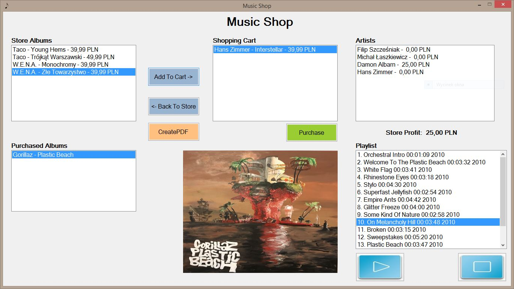

# Music Shop Application - Desktop - Windows Forms

## Table of contents
* [General Info](#general-info)
* [Screenshots](#screenshots)
* [Technologies](#technologies)
* [Features](#features)
* [Running Desktop Application](#running-desktop-application)
* [Library](#library)
* [Additional](#additional)

## General info
Virtual music shop with simple music player as a desktop application.

## Screenshots



## Technologies
Project is created with:
* C# - version 8.0
* Windows Forms - version 2.1.3
* Visual Studio - version 14.0.25422.01 Update 3 2015 Community

## Features
* playing .mp3 files
* virtual music shop
* export music playlists to .pdf file

## Running Desktop Application
* Open Visual Studio
* Click Start

## Library
* [iTextSharp](https://www.nuget.org/packages/iTextSharp/5.5.13.1)


## Additional
* .pdf file path
```sh
C:\Users\User\MusicShopRepository-master\MusicShopUI\bin\Debug\Albums.pdf
```

