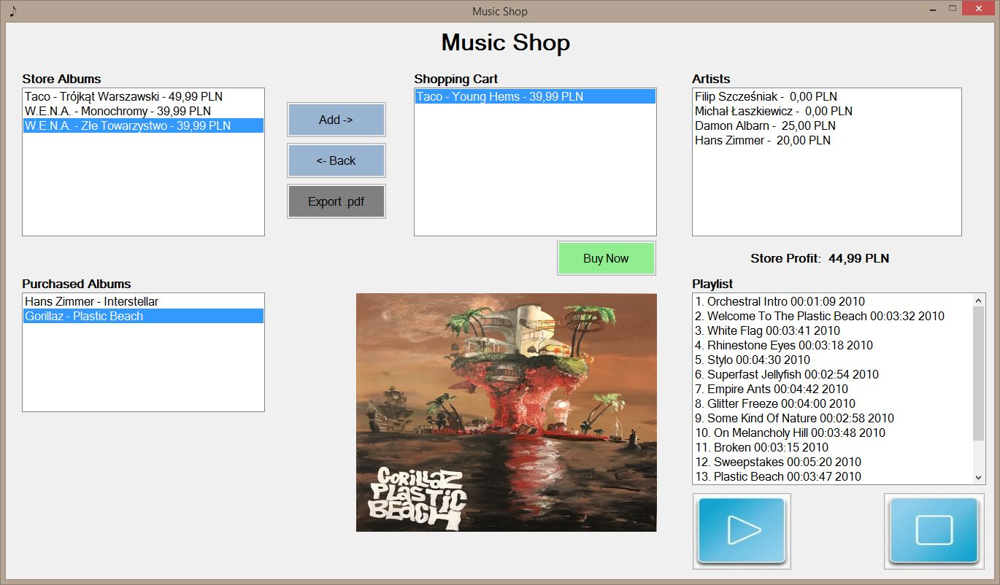
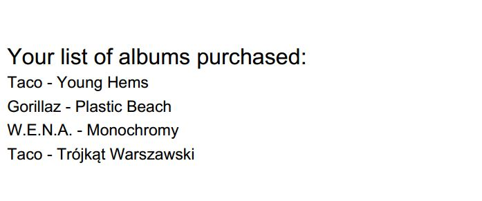
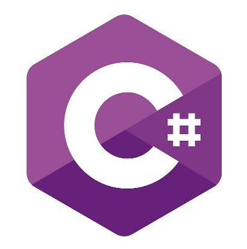
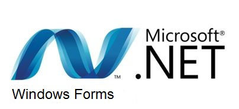
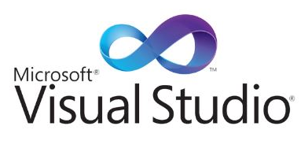
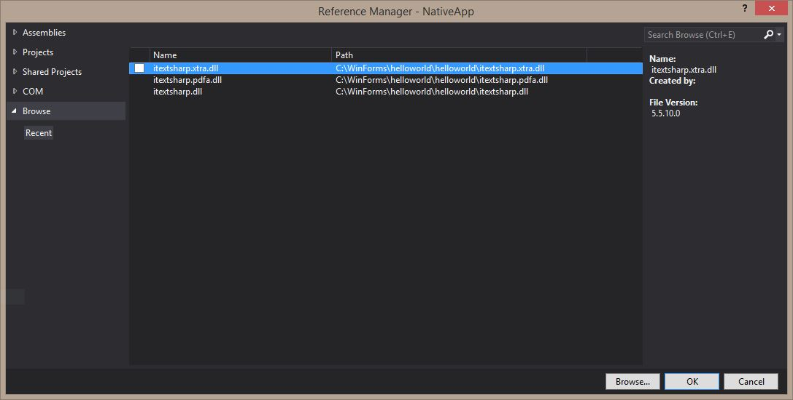

# Music Shop Application - Desktop - Windows Forms

## Table of contents
* [General Info](#general-info)
* [Screenshots](#screenshots)
* [Technologies](#technologies)
* [Features](#features)
* [Running Desktop Application](#running-desktop-application)
* [Library](#library)
* [Additional](#additional)

## General info
Virtual music shop with simple music player as a desktop application.

## Screenshots



## Technologies
Project is created with:
* C# - version 8.0
* Windows Forms - version 2.1.3
* Visual Studio - version 14.0.25422.01 Update 3 2015 Community




## Features
* playing .mp3 files
* virtual music shop
* export music playlists to .pdf file

## Running Desktop Application
* Open Visual Studio
* Click Start

## Library
Packages Manager for .NET - NuGet:
* [itextsharp.xtra.dll](https://www.nuget.org/packages/itextsharp.xtra/)
* [itextsharp.pdfa.dll](https://www.nuget.org/packages/itextsharp.pdfa/)
* [itextsharp.dll](https://www.nuget.org/packages/iTextSharp/)
* [itextsharp](https://github.com/itext/itextsharp)
* [Microsoft.Report.Viewer](https://www.nuget.org/packages/Microsoft.Report.Viewer/)
* [PdfSharp](https://www.nuget.org/packages/PdfSharp/1.51.5185-beta)
* [WMPLib](https://www.nuget.org/packages/WMPLib/)
* [sourceforge](https://sourceforge.net/)



* Help Links:
  * [1](https://forum.android.com.pl/topic/173788-polskie-znaki-przy-budowaniu-pdf-itext/)
  * [2](https://4programmers.net/Forum/Java/93697-IText_Polskie_znaki)
  * [3](https://4programmers.net/Forum/C_i_.NET/159536-ITextSharp_i_CP1250)

## Additional
* .pdf file path:
```sh
C:\Users\User\MusicShopRepository-master\MusicShopUI\bin\Debug\Albums.pdf
```
* .wav file path:
```sh
@"C:\Users\User\MusicShopRepository-master\Resources\sndAddToCart.wav"
```
* .mp3 file path:
```sh

```
* .NET components:
  * listbox
  * button
  * picturebox
  * label
  
* How to use NuGet:
  * Tools -> NuGet Package Manager -> Package Manager Console
  * Tools -> NuGet Package Manager -> Manage NuGet Packages Manager for Solution...
  * Check packages.config file
  * If You have .dll file on desktop You can add reference clicking PPM on References -> Add Reference...
  
## Useful libraries and sides
* C# Open-Source - http://www.csharpopensource.com
* NuGet Package Manager - http://www.xmlpdf.com/dotnetcore.html
* RDLC
* CodeProject - https://www.codeproject.com/Articles/81118/ITextSharp-Helper-Class
* Report Viewer - https://cezarywalenciuk.pl/blog/programing/post/reportviewer-tworzenie-pliku-pdf-w-c
* Converter Audio - https://online-audio-converter.com/pl/
* Converter PDF - https://www.freepdfconvert.com/pl
* Converter PDF - https://smallpdf.com/pl/pdf-do-word
* Download Missing DLL Files - https://www.dll-files.com/
* The Complete Open-Source and Business Software Platform - https://sourceforge.net/
* OpenGL.Net.WinForms v.0.8.4 - https://www.nuget.org/packages/OpenGL.Net.WinForms/
* Web Compression graphic files:
  * https://imagecompressor.com/pl/
  * https://tinypng.com/
  * https://compresspng.com/pl/
* Microsoft .NET Framework 4.8 - https://docs.microsoft.com/pl-pl/dotnet/api/?view=netframework-4.8  
* Microsoft .NET Framework 4.8 - System.Windows.Forms Namespace - https://docs.microsoft.com/pl-pl/dotnet/api/system.windows.forms?view=netframework-4.8
