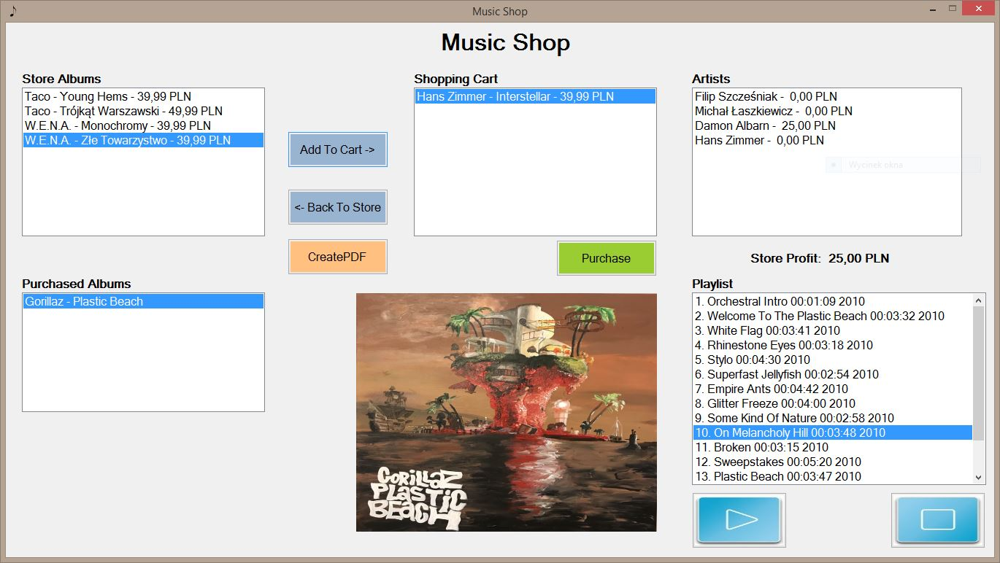
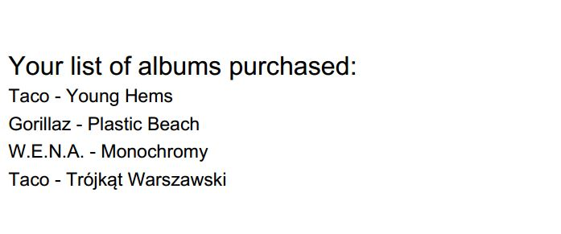

# Music Shop Application

## Table of contents
* [General info](#general-info)
* [Screenshots](#screenshots)
* [Technologies](#technologies)
* [Features](#features)

## General info
Virtual music shop with simple music player as a desktop application.

## Screenshots

## Technologies
Project is created with:
* C# - version 8.0
* Windows Forms - version 2.1.3
* Visual Studio - version 2017 Community

## Features
* playing mp3 files
* virtual music shop
* export music playlists to .pdf file
