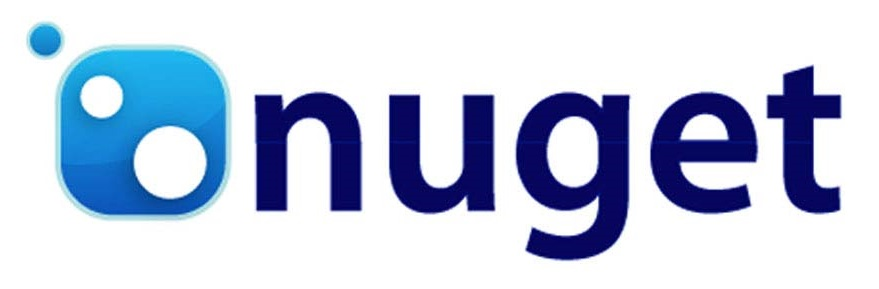

# Music Shop Application - Desktop - Windows Forms
<a href="https://play.google.com/store?hl=pl" target="_blank">
</a>
<a href="https://www.apple.com/pl/ios/app-store/" target="_blank">
</a>


<p align="center"></p>

## Table of Contents 
* [General Info](#general-info-)
* [Screenshots](#screenshots-)
* [Technologies](#technologies-)
* [Features](#features)
* [Running Desktop Application](#running-desktop-application)
* [Library](#library-)
* [Additional](#additional)

## General Info 🎉
Virtual music shop with simple music player as a desktop application.

-------
[](https://www.nuget.org/packages/LiczbyNaSlowaNET.dll/)
[](https://gitter.im/LiczbyNaSlowaNET/Lobby?utm_source=badge&utm_medium=badge&utm_campaign=pr-badge&utm_content=badge)
-----

## Screenshots 📺


## Technologies 🔧
Project is created with:

| Tech                                                    | Version                                  |
| ------------------------------------------------------- | ---------------------------------------- |
| C#                                                      | <i>8.0</i>   |
| Windows Forms                                           | <i>2.1.3</i>    |
| Visual Studio                                           | <i>14.0.25422.01 Update 3 2015 Community</i>    |
| .NET Framework                                          | <i>4.8</i>    |
| SQLite                                                  | <i>3.40.0</i>             |

<i></i>
* C# - <i>version 8.0</i>
* Windows Forms - <i>version 2.1.3</i>
* Visual Studio - <i>version 14.0.25422.01 Update 3 2015 Community</i>
* .NET Framework - <i>version 4.8</i>
* SQLite - <i>version 3.40.0</i>


<p align="center"></p>


<p align="center"></p>


<p align="center"></p>

<p align="center"></p>

<p align="center"></p>

<!-- 


-->


## Features
* playing .mp3 files
* virtual music shop
* export music playlists to .pdf file

## Running Desktop Application
* Open Visual Studio
* Click Start

## Library 🔍
Packages Manager for .NET - NuGet:
* [itextsharp.xtra.dll](https://www.nuget.org/packages/itextsharp.xtra/)
* [itextsharp.pdfa.dll](https://www.nuget.org/packages/itextsharp.pdfa/)
* [itextsharp.dll](https://www.nuget.org/packages/iTextSharp/)
* [itextsharp](https://github.com/itext/itextsharp)
* [Microsoft.Report.Viewer](https://www.nuget.org/packages/Microsoft.Report.Viewer/)
* [PdfSharp](https://www.nuget.org/packages/PdfSharp/1.51.5185-beta)
* [WMPLib](https://www.nuget.org/packages/WMPLib/)
* [sourceforge](https://sourceforge.net/)
* [DocumentFormat.OpenXml](https://www.nuget.org/packages/DocumentFormat.OpenXml/)



* Help Links:
  * [1](https://forum.android.com.pl/topic/173788-polskie-znaki-przy-budowaniu-pdf-itext/)
  * [2](https://4programmers.net/Forum/Java/93697-IText_Polskie_znaki)
  * [3](https://4programmers.net/Forum/C_i_.NET/159536-ITextSharp_i_CP1250)

## Additional
* .pdf file path:
```sh
C:\Users\User\MusicShopRepository-master\MusicShopUI\bin\Debug\Albums.pdf
```
* .wav file path:
```sh
@"C:\Users\User\MusicShopRepository-master\Resources\sndAddToCart.wav"
```
* .mp3 file path:
```sh

```
* .NET components:
  * ListBox
  * Button
  * PictureBox
  * Label
  * GroupBox
  
* How to use NuGet:
  * Tools -> NuGet Package Manager -> Package Manager Console
  * Tools -> NuGet Package Manager -> Manage NuGet Packages Manager for Solution...
  * Check packages.config file
  * If You have .dll file on desktop You can add reference clicking PPM on References -> Add Reference...
  
## Useful Libraries and Websides:
* 10 C# Libraries To Save You Time And Energy - https://www.youtube.com/watch?v=uS0hRJqamfU
  * SharpZipLib - http://icsharpcode.github.io/SharpZipLib/
  * FluentEmail - https://github.com/lukencode/FluentEmail
  * MailKit - https://github.com/jstedfast/MailKit
  * Papercut SMTP - https://github.com/ChangemakerStudios/Papercut-SMTP
  * EPPlus - https://github.com/EPPlusSoftware/EPPlus
  * Hangfire - https://www.hangfire.io/
  * MassTransit - https://masstransit-project.com/
  * Polly - https://github.com/App-vNext/Polly
  * Serilog - https://serilog.net/
  * Seq - https://datalust.co/seq
* C# Open-Source - http://www.csharpopensource.com
* NuGet Package Manager - http://www.xmlpdf.com/dotnetcore.html
* RDLC
* CodeProject - https://www.codeproject.com/Articles/81118/ITextSharp-Helper-Class
* Report Viewer - https://cezarywalenciuk.pl/blog/programing/post/reportviewer-tworzenie-pliku-pdf-w-c
* Converter Audio - https://online-audio-converter.com/pl/
* Converter PDF - https://www.freepdfconvert.com/pl
* Converter PDF - https://smallpdf.com/pl/pdf-do-word
* Download Missing DLL Files - https://www.dll-files.com/
* The Complete Open-Source and Business Software Platform - https://sourceforge.net/
* OpenGL.Net.WinForms v.0.8.4 - https://www.nuget.org/packages/OpenGL.Net.WinForms/
* Web Compression graphic files:
  * https://imagecompressor.com/pl/
  * https://tinypng.com/
  * https://compresspng.com/pl/
* Microsoft Docs - https://docs.microsoft.com/pl-pl/?view=netframework-4.8
* Microsoft .NET Framework 4.8 - https://docs.microsoft.com/pl-pl/dotnet/api/?view=netframework-4.8  
* Microsoft .NET Framework 4.8 - System.Windows.Forms Namespace - https://docs.microsoft.com/pl-pl/dotnet/api/system.windows.forms?view=netframework-4.8
* Dot Net Perls: C# Pages - https://www.dotnetperls.com/
* net-informations.com - http://csharp.net-informations.com/gui/cs-listbox.htm
* Pastebin - https://pastebin.com/
* Cloud Application Platform:
  * GitHub Pages - https://pages.github.com/
  * Heroku - Platform as a Service - https://www.heroku.com/
  * Microsoft Azure - Platform as a Service - https://azure.microsoft.com/pl-pl/
  * Internet Information Services
  * Amazon Web Services - https://aws.amazon.com/
  * Google Cloud - https://cloud.google.com/
  * nginx - https://www.nginx.com/
  * Apache - https://httpd.apache.org/
  * Apache Tomcat - http://tomcat.apache.org/
* Telerik - https://www.telerik.com/
* Telerik UI for WinForms - https://www.telerik.com/products/winforms.aspx
* Telerik UI Documentation - https://www.telerik.com/documentation?utm_source=tci
* Telerik UI Demos - https://www.telerik.com/support/demos?utm_source=tci
* Nie wiesz jakie to rozszerzenie pliku i jak go otworzyć? Sprawdź tutaj - https://www.reviversoft.com/pl/file-extensions
* Color - Hex - https://www.color-hex.com/color/191919
* Flat UI Colors 2 - https://flatuicolors.com/
* Comments - https://www.it-swarm.dev/pl/syntax/komentarze-w-markdown/972100416/
* Syncfusion - https://www.youtube.com/watch?v=Fe1sCEqGHFc || https://www.syncfusion.com/
* WPF Diagram - https://www.codeproject.com/Articles/22952/WPF-Diagram-Designer-Part-1 || https://www.syncfusion.com/wpf-controls || https://www.youtube.com/watch?v=6_nME39Gfm0
  
* Apache HTTP Server - http://httpd.apache.org/
* Apache Tomcat - https://tomcat.apache.org/
* Architectural Patterns: 
  * Model-View-Controller
  * Model-View-View-Model
* Design Patterns:
  * Singleton
  * Builder
  
* Tymczasowy Testowy Adres Mejlowy - https://10minut.xyz/| https://10minutemail.net/ | https://10minemail.com/pl/
* Documentation:
   * DoxyGen - http://www.doxygen.nl/index.html
   * Javadoc - https://www.oracle.com/technetwork/java/javase/documentation/index-137483.html#findjavadoc
   
* Wyświetlenie PDFów w WindowsForms - https://www.facebook.com/groups/net.developers.poland/permalink/1518005951714088/ | https://docs.microsoft.com/pl-pl/dotnet/api/system.windows.forms.webbrowser?view=netcore-3.1 | https://docs.microsoft.com/pl-pl/dotnet/api/system.windows.forms.webbrowser.navigate?view=netcore-3.1
* Open Source PDF library for Java and .NET - https://pdfclown.org/
* Download .NET SDKs for Visual Studio - https://dotnet.microsoft.com/download/visual-studio-sdks?utm_source=getdotnetsdk&utm_medium=referral
* Wykresy w WPF C# - OxyPlot - https://perfectsoft.com.pl/baza-wiedzy/wykresy-w-wpf-csharp-oxyplot/ 

## Team Work:

* Communication - Slack - https://slack.com/intl/en-pl/ - Discord - https://discord.com/
* Version Control System - Git - https://github.com/wojcikpawel/MusicShopRepository.git
* Project Management - Trello - https://trello.com/ - Vivify - https://www.vivifyscrum.com/ - Asana - https://asana.com/ - Jira - https://www.atlassian.com/pl/software/jira
* Docker - https://www.docker.com/

## Icons:
* IconArchive - http://www.iconarchive.com/
* FlatIcon - https://www.flaticon.com/
* icon8.com - https://icons8.com/
* W3schools.com Icons Tutorial - https://www.w3schools.com/icons/default.asp
* Material Design - Icons - https://material.io/resources/icons/?style=baseline
* Vector Stock - https://www.vectorstock.com/
* Iconmonstr - https://iconmonstr.com/
* Material Design Icons - https://materialdesignicons.com/
* Find Icons - https://findicons.com/
* Icon Finder - https://www.iconfinder.com/
* Emojipedia - https://emojipedia.org/television/ - tutaj znajdują się fajne emoji do wykorzystania
* IconBuddy - https://iconbuddy.app/

## Free Graphics To Download:
* Pixbay - https://pixabay.com/pl/
* Unsplash - https://unsplash.com/
* Pexels - https://www.pexels.com/pl-pl/
* PicJumbo - https://picjumbo.com/
* Startupstockphotos - https://startupstockphotos.com/
* Pexels - https://www.pexels.com/pl-pl/

## The World's Best Translator:
* DeepL - https://www.deepl.com/translator
* Photopea - https://www.photopea.com/ - darmowy photoshop w przeglądarce, niezastąpione narzędzie do wszystkiego
* SimilarWeb - https://www.similarweb.com/ - porównywarka stron, już bezpłatna wersja pozwala na rozeznanie co tam u konkurencji w trawie piszczy
* Milled - https://milled.com/ - tworzysz newsletter i szukasz inspiracji? tutaj znajdziesz ich tysiące. To taki newsletterowy Pinterest
* ParpGov - https://www.parp.gov.pl/ - jeśli szukasz statystyk do urozmaicenia swoich materiałów, to tutaj dużo w temacie rynku pracy i przedsiębiorstw
* Jasnopis - https://jasnopis.pl/ || LanguageTool - https://languagetool.org/pl - narzędzie do sprawdzania tekstów, bo im prościej piszesz tym lepiej
* AnswerThePublic - https://answerthepublic.com/
* TypeForm - https://www.typeform.com/ || Mentimeter - https://www.mentimeter.com/ - zbieranie opinii
* Aleo - https://aleo.com/pl/ - baza firm
* Canva - https://www.canva.com/pl_pl/ - projektowanie
* Rejestr.io - https://rejestr.io/ - szukaj w KRS

## Password manager:
* 1Password - https://1password.com/
* Bitwarden - https://bitwarden.com/ || https://sekurak.pl/jak-uzywac-bitwarden-a-kompleksowy-poradnik-uzywania-tego-bezplatnego-menadzera-hasel/
* Nordpass - https://nordpass.com/
* KeePass Password Safe - https://keepass.info/ || https://sekurak.pl/menedzer-hasel-keepassxc-czy-jest-jak-uzywac-poradnik-od-sekuraka/
* LastPass - https://www.lastpass.com/

## Security:
* Haveibeenpwned - https://haveibeenpwned.com/
* Hashcat - https://hashcat.net/wiki/

## Documentation:
* Decision Log - https://www.google.com/search?q=decision+log&oq=Decision+log&aqs=chrome.0.0i512j0i22i30l9.6287j0j1&sourceid=chrome&ie=UTF-8

## Presentation:
* Slides.com - https://slides.com/pawelwojcik/prezentacja/edit

## UI/UX Design:
* https://productvision.pl/2019/projektowanie-ux-ui-8-sposobow-na-to-jak-zaczac/

## Free Video Download:
* https://www.freemake.com/pl/

## Monday:
* https://monday.com/lang/pl/

## API (ang. Application Programming Interface):
* iMapLiteApi - to biblioteka javascript umożliwiającą osadzenie mapy na stronie html oraz wywołanie funkcji pozwalającej na wyszukanie lokalizacji punktu adresowego na podstawie danych adresowych lub bezpośrednio wskazanie lokalizacji punktu o zadanych współrzędnych i wyróżnienie go na mapie w postaci markera/pinezki wraz z wyświetleniem informacji tekstowej w dymku. Przykładową aplikacją korzystającą z API jest: https://integracja.gugik.gov.pl/geoportal_api/?adr=Warszawa,Wsp%C3%B3lna+2&title=G%C5%82%C3%B3wny%20Urz%C4%85d%20geodezji%20i%20Kartografii. Aplikacja posiada dwa parametry wywołania:

‘adr’ - adres prezentowanego obiektu oraz

‘title’ – nazwę obiektu, obie informacje wyświetlane są w dymku wskazującym punkt adresowy.

Tutaj bezpośredni adres - http://mapy.geoportal.gov.pl/iMapLite/doc/

* SoundCloud for Developers - https://developers.soundcloud.com/ || https://developers.soundcloud.com/docs/api/explorer/open-api
* iMapLiteAPI - http://mapy.geoportal.gov.pl/iMapLite/doc/ || https://www.geoportal.gov.pl/pl/usluga/usluga-api/
* NASA API - https://api.nasa.gov/
* MovieDB API - https://developer.themoviedb.org/reference/intro/getting-started
* TempMail API - https://temp-mail.org/en/api

## AI (ang. Artificial Intelligence):
* https://stockimg.ai/home - Tworzenie grafik z wykorzystaniem sztucznej inteligencji

## Tworzenie aplikacji .NET na Raspberry Pi [Kurs C#]:
* https://www.youtube.com/watch?v=0s_kCRHn1ek


Paweł Wójcik &copy;


This application was created by **Paweł Wójcik** <br />
> **Google Play:** https://www.google.pl/ <br />
> **Apple Store:** https://www.google.pl/ <br />
> **Expo:** https://www.google.pl/ <br />

## Inspiration 🔱
This app is inspired by TimCorey: https://www.iamtimcorey.com/

Patreon: https://www.patreon.com/IAmTimCorey

Mailing List: https://signup.iamtimcorey.com/

Purchase Courses: https://www.iamtimcorey.com/
